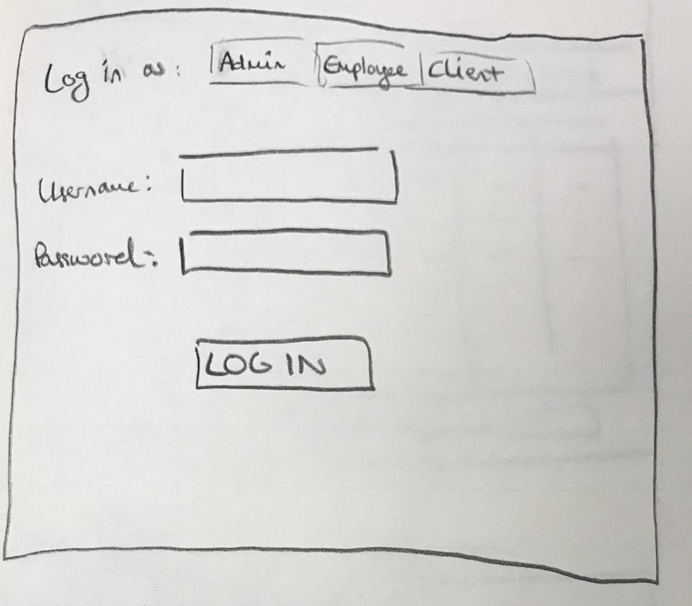
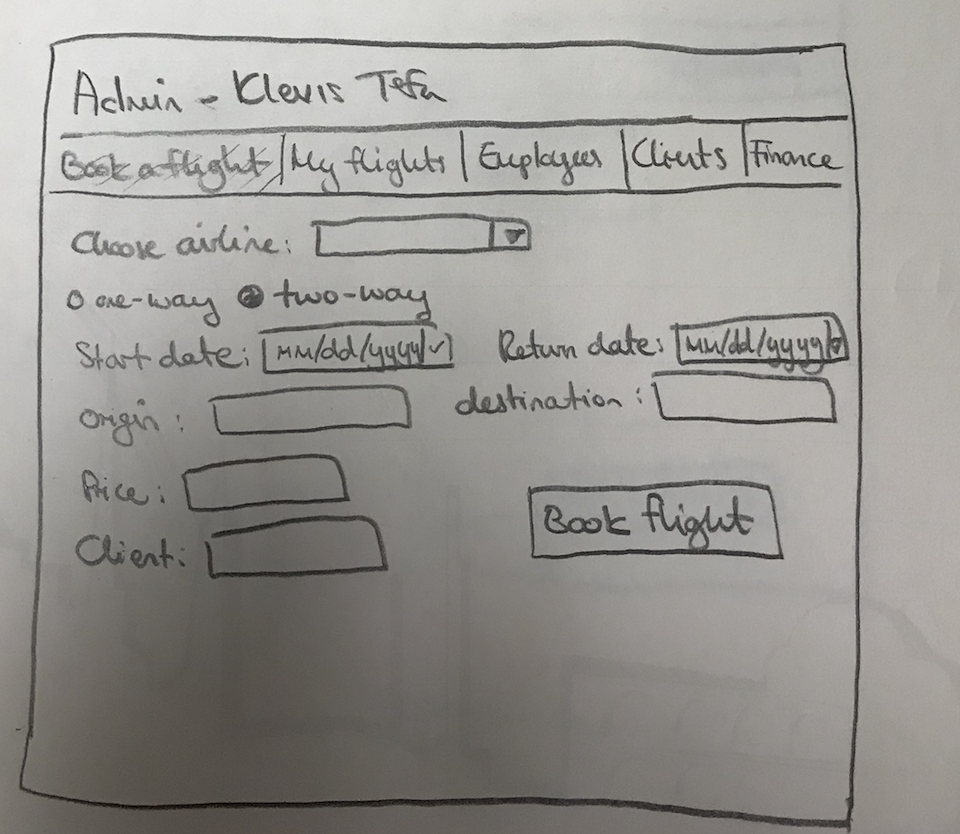
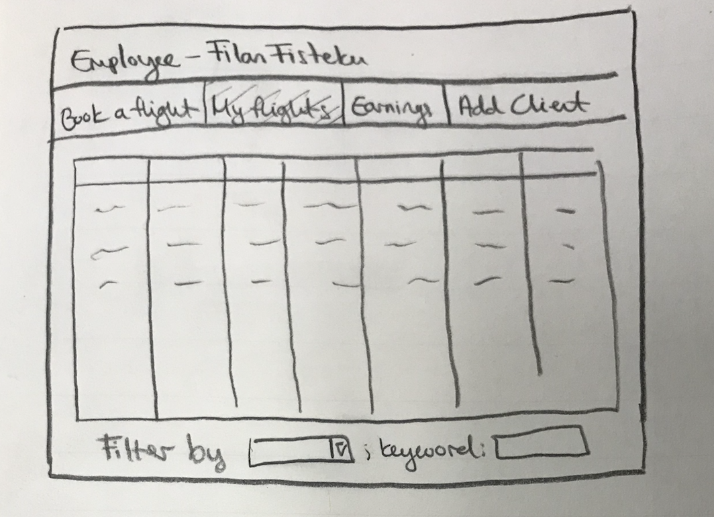
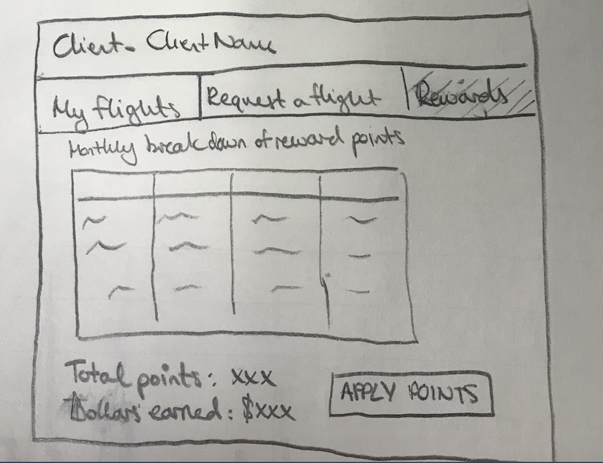
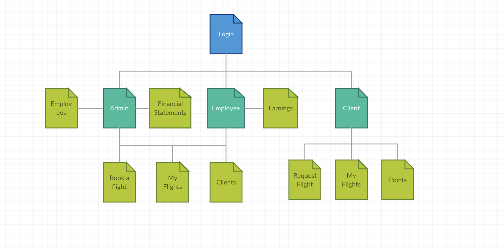

# Travel Agency Data Management System

## Overview

This web app helps small travel agencies to keep track and manage all the type of data that the agency goes through. The data management system will offer
adding, removing, editing, deleting any flight that the agency books. It will also provide a rundown of the financial aspect of the company, where it will calculate the earnings and other financial aspects needed.

Furthermore, the web app will provide three types of users: admin, employee, and client. Each one of the users has different privileges on the system. Admin will have the most privileges. While employees are able to book flights and keep track of their record and also see their bonus earnings based on their flights booked. Clients will be able to register and see their flight history and any potential discounts they get.

## Data Model

The application will store Users (3 types: admin, employee, client), Flight Lists, and Flights

* Users can have multiple lists (via references); Specifically, admin has access to the lists of all booked flights, the flight that he booked, and financial statement. He can also add clients, and employees. Employees, have access to their lists and their personal booked flights. Clients will have access to their own flight history list.

* Flight lists will contain lists of flights depending on the condition of who is accessing the list. Flight lists are a collection of flights booked.

* Users can book multiple flights that are added to lists accordingly.

* Financial statement list contains a collection of flights and rundown by time interval


An Example User:

```javascript
{
  //this is an example of an admin user
  username: "admin",
  hash: // a password hash,
  flightLists: // an array of references to flight list documents,
  personalFlightList: //a list of flight booked by the user,
  privilege: ADMIN,
  //there might be other plausible properties as the project develops
}
```

An example of flight list with embedded flights of a client:

```javascript
{
  user: // a reference to a User object
  name: "Client's flights",
  flights: [
    { airline: "Turkish Airline", price: "$500", type: "one-way", bookedTime://date and time, origin: "Tirane, Albania", destination: "New York, NY, USA", bookedBy: //employee/admin, for://client name},
    { airline: "Spirit Airline", price: "$250", type: "two-way", bookedTime://date and time, origin: "Miami, FL, USA", destination: "New York, NY, USA", bookedBy: //employee/admin, for://client name}
  ],
  points: //points collected that may be used for discount
}
```


## [Link to Commented First Draft Schema](db.js)

## Wireframes

(___TODO__: wireframes for all of the pages on your site; they can be as simple as photos of drawings or you can use a tool like Balsamiq, Omnigraffle, etc._)

Log In Screen - page for logging in as a type of user



Book A Flight - page for booking a flight (in this case signed as admin)



List My Flight - page that lists all the flights that the employee has booked



Client Rewards - page that displays the rewards collected by the employee



## Site map

The site map is subject to change as the project progresses.



## User Stories or Use Cases

1. admin user is provided in the system
2. as an admin I can add/edit/delete other employees
3. as an admin I get can financial statements
4. as an admin or employee I can book flights and add/edit/delete other clients, look at my flights, and my earnings.  
5. as a client I can request to book flights, look at my flight list, and apply reward points

## Research Topics

* (5 points) Integrate user authentication
    * I'm going to be using passport for user authentication.
    * Users will be of three types with different privileges.
    * Any testing is not done yet at this stage of the project.
    * Possible implementation of signing in with a provider
* (2 points) CSS Framework
    * I will be using Bootstrap
    * The design will try to be as user-friendly as possible providing a smooth experience
    * No themed configured at this point.
* (3 points) Unit Testing with JavaScript
    * Unit testing to test the functionalities of each user.
    * Will probably use mocha to implement this

10 points total out of 8 required points

## [Link to Initial Main Project File](app.js)

## Annotations / References Used

1. [passport.js authentication docs](http://passportjs.org/docs)
2. [getting started on Bootstrap](http://getbootstrap.com/docs/4.0/getting-started/introduction/)
3. [unit testing with Mocha](https://github.com/mochajs/mocha)
